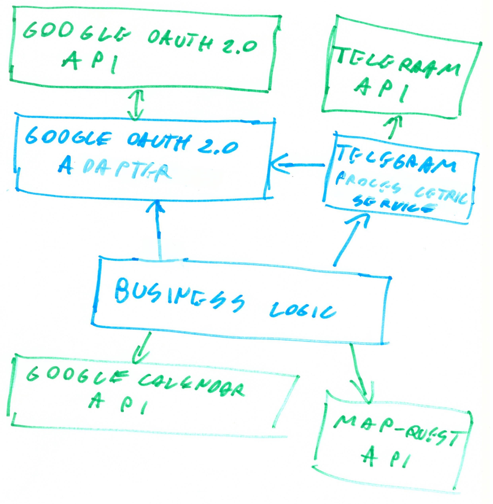

# SDEtelegram-calendar-bot
**Description of the project:**

My project consists in a telegram bot that remains to the user his appointments saved on his Google Account.

The user can login in his Google Calendar Account directly from the telegram chat by requiring a login link through the bot command /login and completing the procedure at the given link.

The bot warns the user ten minute before the start of his appointment.

The user can share his current position whit the bot through the special feature of Telegram.

If the user chose to share his position with the bot, the travel time required for the user to reach the event location from his current position will be subtracted from the starting time of the appointment, so that the user can be warned in time for reaching his appointment.

The travel time is calculated by using the map-quest API.

**Description of the project architecture:**

The project interacts with 4 external API:

- Google OAuth 2.0 API for login in the user Google account.
- Google Calendar API for accessing user&#39;s appointments
- Maps Quest for calculating the travel time from the user position to the event location
- Telegram API for interacting with the user Telegram API

The Project architecture is composed of 3 layers:

All of them are based on RESTful web service technology and use Json for passing data between them.

- Google OAuth 2.0 adapter layer
  - This layer allows other layers to interact with Google OAuth 2.0 API so that the user can authenticate to his google account, it also stores the Google Calendar API token and refresh it when needed.
- Telegram Process centric service layer
  - This layer interacts with the Telegram API and it handles all user&#39;s interaction with the system by providing the ability for the user of logging in in his Google account through the command /login, it register the user current position and make it available to other layers; it also display the welcome message with the bot instructions and show to the user incoming events.
  - This layer also keep track of all the user is interacting with.
- Business logic
  - This layer interact with all the layer of the system and with the Google Calendar API and with the Map Quest API.
  - His purpose is to recover all the useful events from the user Google Calendar API parse them for recovering the start time of the event, add to it the travel time require to reach the event calculated with the Maps Quest API and notify the user of the incoming event through the Telegram Process centric service layer.
  - This layer interacts with Telegram Process centric service layer also to get the user current position.
  - This layer interacts with the Google OAuth 2.0 adapter for receiving the login link for the user.

